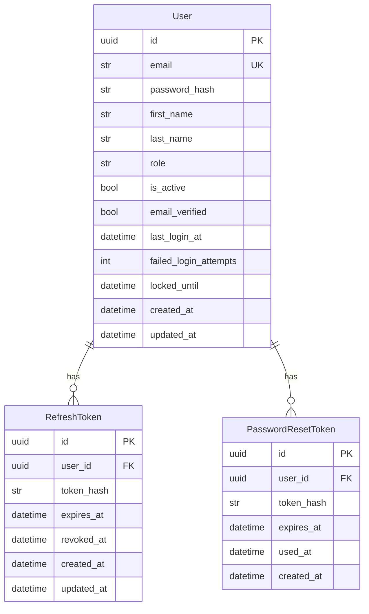

# Data Model: JWT Authentication

**Feature**: 013-fastapi-jwt-auth  
**Spec**: [spec.md](../spec.md)  
**Date**: 2026-04-09

---

## Entity Diagram



---

## Entity Definitions

### 1. User

**Table**: `users`

| Field | Type | Constraints | Description |
|-------|------|-------------|-------------|
| `id` | UUID | PK, default=uuid4 | Unique identifier |
| `email` | str | UNIQUE, INDEX, max_length=255 | Email used for login |
| `password_hash` | str | max_length=255 | bcrypt hash of password |
| `first_name` | str | Optional, max_length=100 | User's first name |
| `last_name` | str | Optional, max_length=100 | User's last name |
| `role` | str | default="user", max_length=50 | Role: `user`, `admin`, `vendor` |
| `is_active` | bool | default=True | Can be set False to disable account |
| `email_verified` | bool | default=False | Requires email verification? |
| `last_login_at` | datetime | Optional, timezone-aware | Timestamp of last successful login |
| `failed_login_attempts` | int | default=0 | Counter for rate limiting |
| `locked_until` | datetime | Optional, timezone-aware | Temporary lock expiry |
| `created_at` | datetime | default=utcnow, timezone-aware | Account creation time |
| `updated_at` | datetime | default=utcnow, onupdate=utcnow, timezone-aware | Last profile update |

**SQLModel class**: `packages/backend/src/models/user.py:User`

**Validation Rules**:
- Email: valid email format, max 255 characters
- Password (on create): minimum 12 chars, uppercase, lowercase, digit, special char
- First/last name: optional, max 100 chars
- Role: one of `["user", "admin", "vendor"]`

**Business Rules**:
- Account lockout after 5 failed login attempts within 15 minutes
- Lock duration: 15 minutes from `locked_until`
- `email_verified` enforced by application logic (optional for MVP)

---

### 2. RefreshToken

**Table**: `refresh_tokens`

| Field | Type | Constraints | Description |
|-------|------|-------------|-------------|
| `id` | UUID | PK, default=uuid4 | Unique token record ID |
| `user_id` | UUID | FK → users.id, ondelete=CASCADE | Owner of the token |
| `token_hash` | str | max_length=255 | SHA-256 hash of the raw token |
| `expires_at` | datetime | timezone-aware | Token expiry (7 days from issue) |
| `revoked_at` | datetime | Optional, timezone-aware | Set when token used/revoked |
| `created_at` | datetime | default=utcnow, timezone-aware | Issue time |
| `updated_at` | datetime | default=utcnow, onupdate=utcnow, timezone-aware | Last update |

**SQLModel class**: `packages/backend/src/models/user.py:RefreshToken`

**Indexes**:
- `INDEX(token_hash)` — fast lookup by token hash during refresh
- `INDEX(user_id, revoked_at, expires_at)` — efficient user token cleanup

**Validation Rules**:
- `token_hash`: always stored as SHA-256 hex digest (64 chars)
- `expires_at`: must be > `created_at` by exactly 7 days
- `revoked_at`: NULL means active token

**Business Rules**:
- Each login/refresh generates a new refresh token, invalidates old ones for that user
- Refresh endpoint checks: token exists, `revoked_at IS NULL`, `expires_at > NOW()`
- On successful refresh: mark old `revoked_at = NOW()`, create new record
- On logout: mark single token `revoked_at = NOW()`

---

### 3. PasswordResetToken

**Table**: `password_reset_tokens`

| Field | Type | Constraints | Description |
|-------|------|-------------|-------------|
| `id` | UUID | PK, default=uuid4 | Unique record ID |
| `user_id` | UUID | FK → users.id | User requesting reset |
| `token_hash` | str | max_length=255 | SHA-256 hash of reset token |
| `expires_at` | datetime | timezone-aware | Expiry (1 hour from issue) |
| `used_at` | datetime | Optional, timezone-aware | Set when password changed |
| `created_at` | datetime | default=utcnow, timezone-aware | Request time |

**SQLModel class**: `packages/backend/src/models/password_reset.py:PasswordResetToken`

**Indexes**:
- `INDEX(token_hash)` — fast lookup during password reset confirmation
- `INDEX(user_id, used_at)` — cleanup of old tokens

**Validation Rules**:
- `token_hash`: SHA-256 hex digest
- `expires_at`: `created_at + 1 hour`
- `used_at`: NULL until single use, then set to NOW()

**Business Rules**:
- Token single-use: `used_at IS NOT NULL` invalidates
- Tokens older than 24 hours can be cleaned up by a periodic job
- Invalidate all existing refresh tokens for the user upon successful password reset

---

## State Transitions

### User Account States

```
[registered] --(email_verified=False)--> [unverified]
[registered] --(email_verified=True)--> [active]
[active] --(failed_login_attempts>=5 within 15min)--> [locked]
[active] --(admin sets is_active=False)--> [disabled]
[unverified] --(email verification link)--> [active]
[locked] --(locked_until expiry)--> [active]
[disabled] <--(admin re-enables)--- [active]
```

### Refresh Token Lifecycle

```
[created] --(token issued at login/refresh)--> [active]
[active] --(client uses token)--> [revoking]
[active] --(user logs out)--> [revoked]
[active] --(expires_at passes)--> [expired]
[active] --(password reset)--> [revoked (bulk)]
[revoking] --(rotation completes)--> [revoked] + [new active]
```

**Note**: The `revoking` state is a transition window; the token is invalid by the time DB commit completes.

---

## Migration Path (Alembic)

**Existing state**: User model already exists with `failed_login_attempts`, `locked_until` fields.

**New tables to add**:
1. `refresh_tokens` — not present in current schema
2. `password_reset_tokens` — not present in current schema

**Index additions**:
- On `refresh_tokens(token_hash)`
- On `refresh_tokens(user_id, revoked_at, expires_at)` (composite)
- On `password_reset_tokens(token_hash)`

**No breaking changes**: Existing `users` table already has required auth fields.

See `specs/013-fastapi-jwt-auth/contracts/migration_001_refresh_tokens.sql` for the migration script.

---

## Data Retention & Cleanup

| Data | Retention | Cleanup Mechanism |
|------|-----------|-------------------|
| `refresh_tokens` (revoked, expired) | 30 days | Periodic job: DELETE WHERE `revoked_at IS NOT NULL` AND `expires_at < NOW() - 30d` |
| `password_reset_tokens` (used, expired) | 7 days | Periodic job: DELETE WHERE `used_at IS NOT NULL` OR `expires_at < NOW()` |
| `users` (is_active=False) | Indefinite | No automatic deletion; GDPR compliance handled separately |

---

## Validation Summary

All input validation is performed via Pydantic schemas in `contracts/`:

- **Registration**: `UserRegister` schema validates password strength
- **Login**: `UserLogin` OAuth2PasswordRequestForm validates required fields
- **Token Refresh**: `TokenRefresh` validates single `refresh_token` field
- **Password Reset**: `PasswordResetRequest` validates email; `PasswordResetConfirm` validates password strength

SQLModel models above enforce database-level constraints (unique, foreign keys, field lengths).
